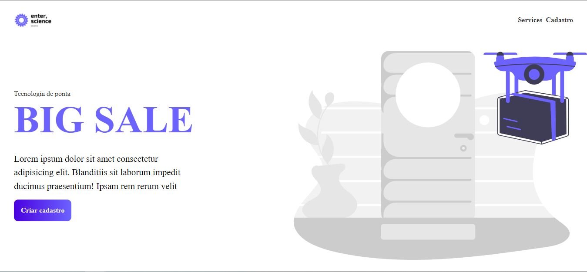

## Enterscience challenge



### Requisitos

- xampp
- PHP
- node 14.18.0 (para o React)
- mySQL
- CORS chrome extension

```
npm install
```
```
npm run dev
```

link do site: https://enterscience.vercel.app/
<br>
site em uso: https://youtu.be/-Pk4DaL7378
<br>
A pasta react-backend contendo o index.php deve ser colocada dentro da pasta htdocs do xampp, para que o servidor possa ser rodado localmente.